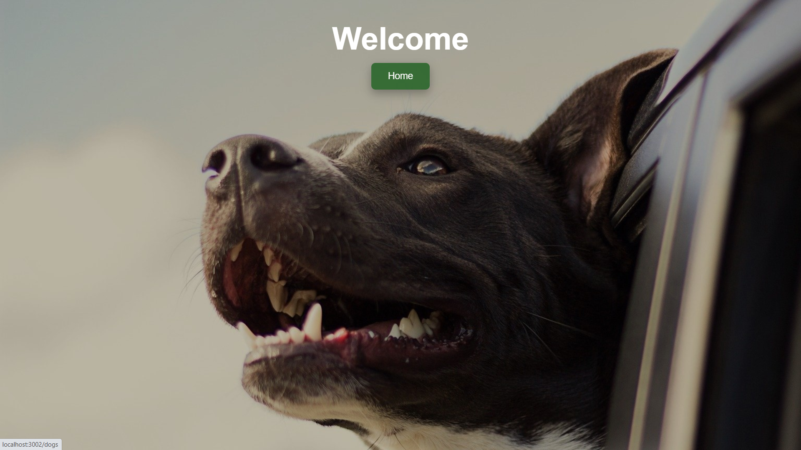
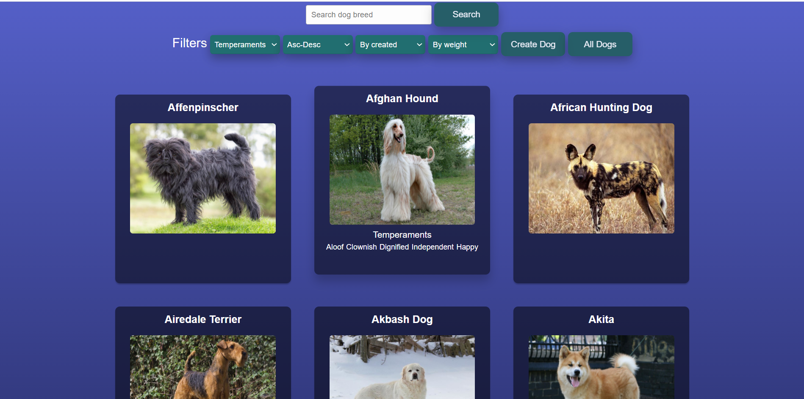
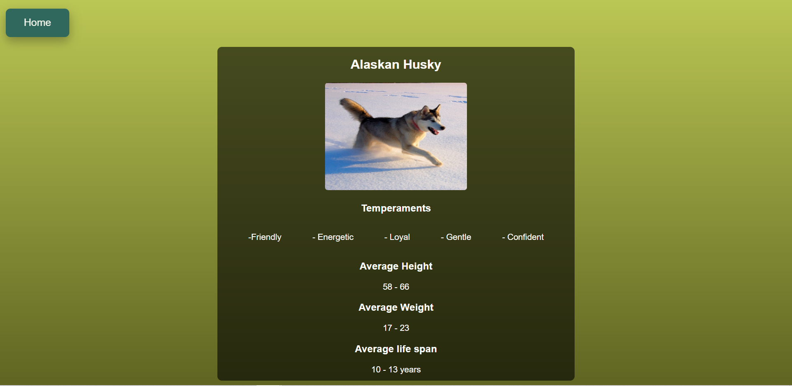
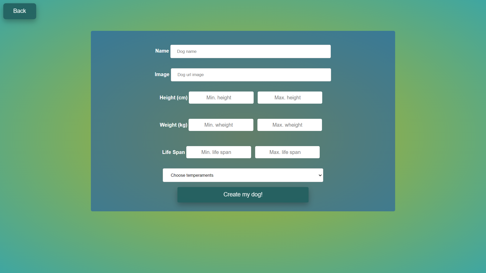

    

# Project - Dogs App 🐕

Dogs App is an individual project where I use the whole concepts and technologies that we have been learning in Herny Bootcamp.
Here some details and information...

✔Users functionalities:
-Look all the breed dogs, created and from the api rest (The Dog Api)
-Filter by temperament
-Search by name 
-Create a new breed dog
-Sort by weight
-Sort alphabetically

🔹Technologies used:
ReactJS -NodeJS- ReduxJS -JavaScript -PosgresSQL -Express -Sequalize -CSS

<h3>Landing Page</h3>

<h3>Home<h3>

<h3>Dog Detail<h3>

    
<h3>Create dog<h3>

##  Run the next command lines to getting started 💻

First you'll have to clone this repository in a folder in your computer, then you'll have to open your console in that directory and: 

- cd api
- npm install 
- npm start

This will start the back-end server on your localhost:3001/

Then you must go back to the root directory of the project and: 

- cd client
- npm install
- npm start 

This will start the app on your localhost:3000

Aditionally you'll have to create your local SQL database called 'food' in order to store your own dogs.
